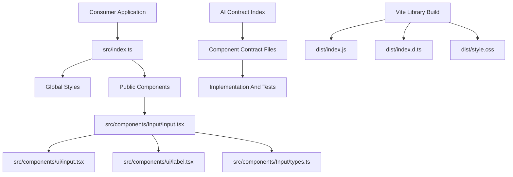

# Library Architecture

## Purpose

Mezmer is a reusable React UI package focused on composable components, strict contracts, and publishable library ergonomics.

## Design Principles

- Presentational core components only.
- Dependency injection through props and callbacks.
- Stable, typed public APIs.
- Contract-driven behavior and tests.
- Tree-shake friendly module exports.

## AI And MCP Context Model

Mezmer uses a dual-context architecture for AI-assisted implementation:

- Human context: `README.md`, `docs/CONTRIBUTING.md`, `docs/ARCHITECTURE.md`, and workspace instructions.
- Structured context: machine-readable contracts in `ai/contracts`.

MCP note:

- Mezmer exposes structured repository artifacts through a repository-local MCP server.
- The MCP server reuses `ai/contracts/index.json`, component/theme contracts, docs, and validation scripts as its source of truth.
- MCP-enabled agents can query that server instead of inferring behavior from raw repository traversal.
- The server implementation lives in `scripts/mcp-server.mjs`.

## High-Level Structure



## Source Layout

- `src/index.ts`: package entrypoint, exports components, imports global styles.
- `src/components/*`: component modules with implementation, public types, tests, and barrel exports.
- `src/components/ui/*`: local shadcn primitives used as composition building blocks.
- `src/lib/*`: lightweight shared utilities.
- `src/styles.css`: package-owned styling surface shipped to consumers.
- `src/themes/*.css`: built-in pre-styled themes (default, slate, and active selector).
- `ai/contracts/*`: machine-readable behavior contracts and states.

## Theming Architecture

- Semantic Tailwind classes resolve from namespaced tokens (`--mz-*`) to avoid host collisions.
- `src/styles.css` contains shared base styles and token bridge defaults.
- `src/themes/default.css` and `src/themes/slate.css` are shipped pre-built themes.
- `src/themes/active.css` is generated by `pnpm theme:apply` and imports the selected built-in theme.
- Consumers can provide shadcn-compatible host tokens or custom `--mz-*` overrides without changing component APIs.

## CI Enforcement Model

Core CI workflow (`.github/workflows/ci.yml`) enforces:

- contract integrity (`pnpm validate:contracts`)
- component docs coverage (`pnpm validate:component-docs`)
- theme registry availability (`pnpm theme:list`)
- theme script integration checks (`pnpm test:scripts`)
- lint, type-check, tests, and build

Docs workflow (`.github/workflows/docs-deploy.yml`) builds VitePress and deploys to GitHub Pages.

## AI-First Theme Workflow

1. Discover available themes with `pnpm theme:list`.
2. Switch the active theme with `pnpm theme:apply --theme <id>`.
3. Scaffold custom themes with `pnpm theme:create --id <id> --from <base-id>`.
4. Validate theme and component contracts with `pnpm validate:contracts`.

Theme contracts live in `ai/contracts/themes`, theme selection state in `ai/theme.active.json`, and all assets are validated in CI.

## How It Works

1. Consumer imports from the package root export.
2. Entrypoint exports component modules and ships package styles.
3. Components compose shadcn primitives and accept domain-neutral props.
4. Access behavior is resolved through injected callbacks rather than host integration.
5. Build pipeline emits ESM output and declaration files for package consumers.

## Contract-To-Code Lifecycle

1. Read component contract.
2. Implement or update component behavior.
3. Keep tests aligned with contract states.
4. Update consumer docs under `docs/components`.
5. Validate with contracts, docs coverage checks, lint, type-check, tests, and build.

## Release Validation

```bash
pnpm lint
pnpm tsc --noEmit
pnpm test
pnpm build
```
