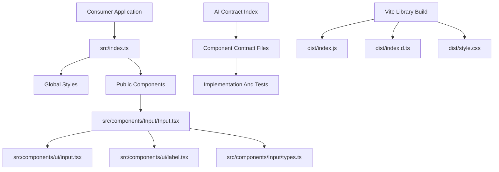

# Library Architecture

## Purpose

Mezmer is a reusable React UI package focused on composable components, strict contracts, and publishable library ergonomics.

## Design Principles

- Presentational core components only.
- Dependency injection through props and callbacks.
- Stable, typed public APIs.
- Contract-driven behavior and tests.
- Tree-shake friendly module exports.

## High-Level Structure



## Source Layout

- `src/index.ts`: package entrypoint, exports components, imports global styles.
- `src/components/*`: component modules with implementation, public types, tests, and barrel exports.
- `src/components/ui/*`: local shadcn primitives used as composition building blocks.
- `src/lib/*`: lightweight shared utilities.
- `src/styles.css`: package-owned styling surface shipped to consumers.
- `ai/contracts/*`: machine-readable behavior contracts and states.

## How It Works

1. Consumer imports from the package root export.
2. Entrypoint exports component modules and ships package styles.
3. Components compose shadcn primitives and accept domain-neutral props.
4. Access behavior is resolved through injected callbacks rather than host integration.
5. Build pipeline emits ESM output and declaration files for package consumers.

## Contract-To-Code Lifecycle

1. Read component contract.
2. Implement or update component behavior.
3. Keep tests aligned with contract states.
4. Validate with lint, type-check, tests, and build.

## Release Validation

```bash
pnpm lint
pnpm tsc --noEmit
pnpm test
pnpm build
```
